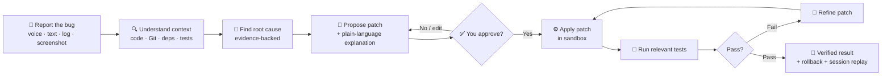
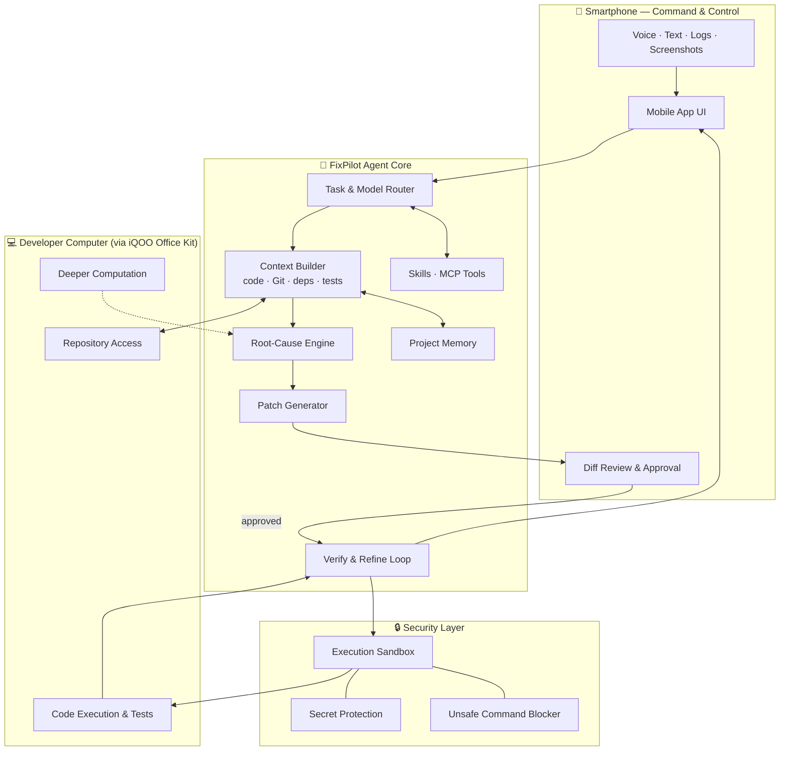

<div align="center">

# 🛠️ FixPilot

### From *"I found a bug"* → *"I understand why"* → *"I fixed it"* → *"I verified it"*

**A phone-first, AI-powered autonomous debugging and maintenance agent.**
Investigate, fix, test and verify real software issues — straight from your smartphone.


**Team MOHOMAYA** · iQOO Hackathon 2026

</div>

---

## 📖 Table of Contents

- [The Problem](#-the-problem)
- [What FixPilot Does](#-what-fixpilot-does)
- [How It Works](#-how-it-works)
- [Key Features](#-key-features)
- [Architecture](#-architecture)
- [Security & Safety](#-security--safety)
- [Phone + iQOO Office Kit](#-phone--iqoo-office-kit)
- [Tech Stack](#-tech-stack)
- [Getting Started](#-getting-started)
- [Project Structure](#-project-structure)
- [Roadmap](#-roadmap)
- [Team](#-team)

---

## 🎯 The Problem

Bugs don't wait for you to sit at your desk. A production error arrives while you're commuting, a teammate sends a crash screenshot at night, a CI run fails while you're away from your laptop.

Today the phone is only a **passive companion** for developers: you can read logs and chat messages, but you can't *investigate*, *fix* and *verify* anything. Fixing a bug still means opening a laptop, finding the right code, guessing at the cause, patching, and re-running tests by hand.

## 💡 What FixPilot Does

FixPilot turns the smartphone into a **trusted, multimodal, autonomous developer command center**.

You describe the problem by **voice, text, error log or screenshot**. FixPilot reads your codebase, finds the root cause using real evidence, proposes a safe patch, waits for your approval, applies it, runs the tests, refines the fix if something fails, and shows you the verified result.

> The phone is the **control interface**. The developer's computer does the heavy lifting.

---

## 🔄 How It Works



| Stage | What happens |
|---|---|
| **1. Report** | Send a voice note, text, stack trace, log file or screenshot of the error. |
| **2. Understand** | The agent maps repo structure and gathers evidence from source, Git history, logs, dependencies and tests. |
| **3. Diagnose** | It identifies the root cause and shows the evidence that points to it. |
| **4. Propose** | A minimal, reviewable patch is generated with a clear explanation. **Nothing is changed yet.** |
| **5. Approve** | You review the diff on your phone and approve, edit or reject. |
| **6. Verify** | Relevant tests run automatically. On failure, the agent refines the patch and retries. |
| **7. Wrap up** | You get the final verified result, with one-tap rollback and a replayable session. |

---

## ✨ Key Features

### 🎙️ Multimodal Input
Voice commands, text, error logs and screenshots — report bugs the way that is fastest in the moment.

### 🧭 Codebase-Aware Root-Cause Analysis
Understands project structure and reasons over **source code, Git history, logs, dependencies and tests**, so conclusions are backed by evidence rather than guesses.

### 🛡️ Approval-First Patching
Every fix is explained and shown as a reviewable diff **before** anything is applied.

### 🧪 Self-Verifying Fix Loop
Runs relevant tests after applying a patch, detects failures, refines the patch and re-verifies.

### 🔀 Intelligent Model Routing
Different tasks go to different **local / open-source models** — lightweight models for quick classification and OCR-style tasks, stronger models for reasoning and code generation.

### 🧠 Project-Level Memory
Remembers project conventions, past bugs, earlier fixes and test behaviour so it gets more useful over time.

### 🧩 Modular Skills & MCP Tools
Extend the agent with developer **skills** and **MCP-based tools** without touching the core.

### 🔒 Security Sandbox
Protects secrets and blocks unsafe commands. All execution happens inside a controlled sandbox.

### ⏪ Rollback & Session Replay
Undo any applied change in one step, and replay the full debugging session — what was read, what was inferred, what was run.

---

## 🏗️ Architecture



---

## 🔐 Security & Safety

FixPilot is built so a mistake by the AI can't become a disaster for your codebase.

- **Human-in-the-loop** — no patch is applied without explicit approval.
- **Secret protection** — secrets and credentials are kept out of prompts, logs and replays.
- **Command blocking** — dangerous or destructive commands are detected and refused.
- **Sandboxed execution** — code and tests run in an isolated environment.
- **Full rollback** — every change can be reverted.
- **Auditable sessions** — replay shows exactly what the agent did and why.

---

## 📲 Phone + iQOO Office Kit

The phone is the **primary command interface**; **iQOO Office Kit** connects it to the developer's computer.

| Phone handles | Computer handles (via Office Kit) |
|---|---|
| Voice, text and screenshot capture | Repository access |
| Plan, diagnosis and diff review | Code execution and test runs |
| Approval, rejection and rollback | Heavier model inference and deeper computation |
| Session replay and status | Build and dependency tooling |

---

## 🧰 Tech Stack

> Update this table to match what you actually build.

| Layer | Technology |
|---|---|
| Mobile app | *e.g. React Native / Expo, Flutter, or native Android* |
| Agent backend | *e.g. Python (FastAPI)* |
| Local / open-source models | *e.g. via Ollama or llama.cpp — code model, vision/OCR model, speech-to-text* |
| Tooling protocol | MCP (Model Context Protocol) |
| Code analysis | *e.g. tree-sitter, Git integration* |
| Sandbox | *e.g. containerised or restricted subprocess runner* |
| Phone ↔ computer link | iQOO Office Kit |

---

## 🚀 Getting Started

> Replace the commands below with your real setup steps.

```bash
# 1. Clone the repository
git clone https://github.com/<your-org>/fixpilot.git
cd fixpilot

# 2. Start the agent backend on your computer
cd backend
pip install -r requirements.txt
python main.py

# 3. Run the mobile app
cd ../mobile
npm install
npx expo start
```

**Connect the phone and computer** using iQOO Office Kit, then point FixPilot at your project folder from the app.

### Example session

```text
🎙️  "The login page crashes when the email field is empty."

🔍  Found: null access in validateUser() — src/auth/validate.js:42
    Evidence: stack trace + commit a1b2c3d removed the empty-string guard.

📝  Proposed patch: restore the guard (2 lines changed). Approve?

✅  Approved → patch applied → 14 related tests ran → all passing.
⏪  Rollback available · 🎞️ Session replay saved.
```

*(Illustrative example of the intended flow.)*

---

## 📁 Project Structure

```text
fixpilot/
├── mobile/            # Phone-first command & control app
├── backend/
│   ├── router/        # Task and model routing
│   ├── context/       # Code, Git, logs, dependency analysis
│   ├── rca/           # Root-cause reasoning
│   ├── patch/         # Patch generation and refinement
│   ├── verify/        # Test running and verification loop
│   ├── memory/        # Project-level memory
│   ├── skills/        # Modular developer skills
│   ├── mcp/           # MCP tool integrations
│   └── security/      # Sandbox, secret guard, command blocker
├── docs/
└── README.md
```

---

## 🗺️ Roadmap

- [ ] Voice, text, log and screenshot intake
- [ ] Repository context builder (code, Git, dependencies, tests)
- [ ] Evidence-backed root-cause analysis
- [ ] Patch proposal with approval flow
- [ ] Automatic test run and patch refinement loop
- [ ] Security sandbox and unsafe-command blocking
- [ ] Rollback and debugging-session replay
- [ ] Project memory
- [ ] Skills and MCP tool support
- [ ] iQOO Office Kit phone ↔ computer integration

*(Tick these off as you build them.)*

---


| Alok Halder |

---

<div align="center">

**FixPilot — your phone, now a developer command center.**

</div>
