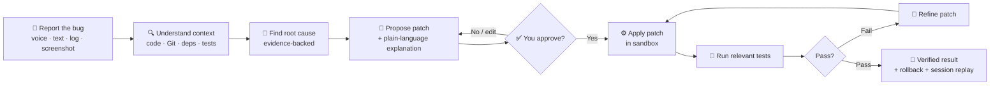

<div align="center">

# 🛠️ FixPilot

### From *"I found a bug"* → *"I understand why"* → *"I fixed it"* → *"I verified it"*

**A phone-first, AI-powered autonomous debugging and maintenance agent.**
Investigate, fix, test and verify real software issues — straight from your smartphone.


</div>

---

## 🎯 The problem

Bugs don't wait for you to sit at your desk. A production error arrives while you're commuting, a
teammate sends a crash screenshot at night, a CI run fails while you're away from your laptop.

Today the phone is only a **passive companion** for developers: you can read logs and chat
messages, but you can't *investigate*, *fix* and *verify* anything. Fixing a bug still means
opening a laptop, finding the right code, guessing at the cause, patching, and re-running tests by
hand.

FixPilot turns the smartphone into a **trusted, multimodal, autonomous developer command center**.
You describe the problem by voice, text, error log or screenshot; FixPilot reads your codebase,
finds the root cause using real evidence, proposes a safe patch, waits for your approval, applies
it, runs the tests, refines the fix if something fails, and shows you the verified result.

> The phone is the **control interface**. The developer's computer does the heavy lifting.

FixPilot is a phone-first, autonomous software-maintenance agent. A bug report goes in — a
sentence, a voice note, a pasted traceback, a screenshot — and a **verified** patch comes out,
with a mandatory human approval step in between.

Everything runs on the machine that holds the repo. No code leaves it unless you explicitly
configure a cloud model. The default reasoning path is local and deterministic, so the product
works with **zero API keys**.



---

## Quickstart

FixPilot is pure Python 3.11+ with **no third-party dependencies** (the MCP layer is a
hand-rolled JSON-RPC client/server for exactly this reason).

```bash
git clone https://github.com/Alok1418-ai/FixPilot.git
cd FixPilot

# 1. one-screen check that it sees the repo
python3 -m fixpilot --repo examples/sample-project status

# 2. start the phone-facing server (binds 0.0.0.0:8787)
python3 -m fixpilot --repo /path/to/your/repo serve --verbose
#    open http://<your-computer>:8787 on the phone — the first visit asks you to
#    create the owner account, then you land on the dashboard

# 3. or drive it from the shell
python3 -m fixpilot --repo /path/to/your/repo fix "$(cat traceback.txt)"
```

Want the whole loop unattended (still gated by the approval flag)? Use `--apply`:

```bash
python3 -m fixpilot --repo /path/to/your/repo fix "checkout crashes for unknown SKUs" \
  --apply --no-prompt
```

### Try it on the bundled sample project

`examples/sample-project` is a tiny stdlib-only shop with three intentional bugs and the
PagerDuty-style reports that describe them:

```bash
python3 -m fixpilot --repo examples/sample-project serve
# then: reports/bug-001-critical-stock-lookup.txt  → POST /api/sessions
python3 scripts/evaluate.py        # end-to-end benchmark, prints a scorecard
```

---

## How a session runs

| Stage | What happens | Where |
| --- | --- | --- |
| **Intake** | Text, logs, voice transcripts and screenshots are normalised into one `IngestedInput` with signals (traceback frames, log errors, screenshot hints, repro commands). | `fixpilot/models/media.py` |
| **Investigate** | 11 developer skills run against the index, call graph, git history, dependencies and past lessons; each contributes scored evidence. | `fixpilot/skills/`, `fixpilot/core/engine.py` |
| **Rank** | Hypotheses are scored as `confidence·0.55 + evidence_strength·0.30 + category_prior·0.15`, penalised for test files, boosted for risky Python patterns. | `fixpilot/skills/base.py` |
| **Draft** | Deterministic patch strategies (fallback guards, boundary checks, log-and-reraise, input validation, …) plus optional model-authored candidates; each is validated against the security policy before it is shown. | `fixpilot/core/fixes.py`, `fixpilot/security/patch.py` |
| **Approve** | The patch is presented with a risk badge, blast radius, behaviour-change note and a spoken-style summary. **Nothing is written until the human confirms.** | `fixpilot/core/agent.py::approve` |
| **Apply → Test → Refine** | Patch is applied with a backup, the narrowed test command runs, failures are fed back into the next candidate (up to `MAX_REFINE_ITERATIONS`), and the session ends `verified` or `rolled_back`. | `fixpilot/core/verifier.py`, `fixpilot/core/agent.py::apply_and_verify` |
| **Replay** | Every step is an event on `sessions/<id>/events.jsonl` — you can replay the debugging session (including the reasoning) later. | `fixpilot/memory/sessions.py` |

A fix is never reported as "fixed": the only terminal success state is `verified`, which requires
an **executed** test run that actually passes. Otherwise the session stays `partial`/`failed`.

---

## Interfaces

**Phone PWA** (`fixpilot/web/`) — offline-capable single page, no build step, served from the
same process as the API. `GET /` inlines the mutation token into the page so the phone can
approve/apply; `sw.js` caches the shell; every request is same-origin and relative.

Five tabs, each backed by the JSON API:

| Tab | What you can do | Endpoints |
| --- | --- | --- |
| **📊 Home** | Dashboard: KPIs (sessions, verified, verify rate, lessons), repo state, session-outcome bars, recent activity, safety snapshot | `/api/dashboard` |
| **🛠 Fix** | Report by voice / text / log / screenshot, preview what was understood, review the patch (diff, stats, blast radius, risk), approve, apply, re-verify, refine, roll back, replay | `/api/input`, `/api/samples`, `/api/sessions*` |
| **🗂 Sessions** | Browse and reopen past debugging sessions | `/api/sessions` |
| **📁 Repo** | Search symbols and code, browse the file tree, read any file (secrets redacted), see the live working-tree diff | `/api/search`, `/api/tree`, `/api/file`, `/api/diff/worktree` |
| **⋯ More** | Hub for **Console** (`/api/command`, `/api/ask`), **Safety** (`/api/sandbox`, `/api/audit`, `/api/lessons`) and **System** (`/api/overview`, `/api/models`, `/api/skills`, `/api/memory`, `/api/officekit*`), plus the signed-in account and sign-out | — |

A health poll every 15 s drives the link pill, so a dropped server is visible on screen rather
than only as a failed request. An expired session bounces you back to the sign-in screen instead
of failing silently.

**CLI** (`python3 -m fixpilot …`)

```
serve       phone-facing web server (PWA + JSON API, token-gated mutations)
index       build/refresh the codebase index
fix         investigate a report, propose a patch, optionally apply+verify
ask         ask a question about the repository
sessions    list | show | replay | timeline | report | rollback | diff
skills      the registered developer skills and their costs
models      routing table and provider availability
memory      project-level memory for this repository
lessons     what previous sessions learned here
officekit   pair | list | queue | worker  (iQOO Office Kit relay)
mcp         serve | tools | call | client  (Model Context Protocol)
status      one-screen overview
```

**MCP** — FixPilot is both a tool server and a tool client:

```bash
python3 -m fixpilot mcp tools                 # 13 tools with arg hints
python3 -m fixpilot --repo R mcp client \
  --server-cmd "python3 -m fixpilot --repo R mcp serve" --list
echo '{"jsonrpc":"2.0","id":1,"method":"tools/list"}' | python3 -m fixpilot mcp serve
```

Exposed tools: `fixpilot_overview`, `fixpilot_search`, `fixpilot_read_file`,
`fixpilot_list_sessions`, `fixpilot_session`, `fixpilot_investigate`, `fixpilot_decide`,
`fixpilot_apply`, `fixpilot_verify`, `fixpilot_policy_check`, `fixpilot_report`,
`fixpilot_replay`, `fixpilot_officekit_enqueue`. Mutating tools refuse to run without
`confirm=true`, and every call is written to the audit log.

**iQOO Office Kit bridge** (`fixpilot/officekit.py`) — pairs a phone with the workstation and
relays jobs the phone cannot do itself over a durable queue with heartbeats, claim/complete and a
worker:

| Phone handles | Computer handles (via Office Kit) |
| --- | --- |
| Voice, text and screenshot capture | Repository access |
| Plan, diagnosis and diff review | Code execution and test runs |
| Approval, rejection and rollback | Heavier model inference and deeper computation |
| Session replay and status | Build and dependency tooling |

```bash
python3 -m fixpilot officekit pair --name "iQOO 13"
python3 -m fixpilot officekit queue --kind run_command --run "git log --oneline -3"
python3 -m fixpilot officekit worker
```

---

## Safety model

This is the part that makes an autonomous agent usable on a real repository.

* **Sign-in gate.** `FIXPILOT_AUTH=true` by default. Before this existed, `GET /` inlined a valid
  mutation token into the page for *anyone* who could reach the port — so any device on the LAN
  could approve patches and run commands. The token only ever stopped cross-origin CSRF; it was
  never an identity check. Now the whole API is closed until you sign in: passwords are PBKDF2-SHA256
  hashed with a per-user random salt, compared with `hmac.compare_digest`, stored `0600` under
  `<repo>/.fixpilot/auth/`, and sessions are opaque server-side `secrets` tokens in an
  `HttpOnly; SameSite=Strict` cookie. The first account created is the owner; `setup` refuses to run
  twice, and self-service sign-up is **off** unless you set `FIXPILOT_ALLOW_SIGNUP=true`.
* **Approval gate.** `REQUIRE_APPROVAL=true` by default. The proposal path cannot write; the
  write path cannot run without a recorded approval (API `POST /approve`, CLI prompt, or MCP
  `fixpilot_decide` with `confirm=true`).
* **Command policy + sandbox.** Shell commands are classified allow / confirm / deny before
  execution. Destructive idioms (`rm -rf /`, `dd`, fork bombs, `curl | sh`, …) are denied;
  network and dependency installation are confirmation-gated and off by default. The executor
  runs with a timeout (300 s), an output cap (256 KB) and a scrubbed environment.
* **Secret protection.** Values are redacted from anything that could leave the machine (model
  prompts, MCP text, API responses, reports) and `.env`-style files are blocked from patch
  writes. `SecretScanner.sanitize()` keeps the label and kills the value.
* **Patch validation.** Unified diffs are parsed and validated before they touch disk: path
  traversal refused, sensitive paths refused, size/file-count caps (200 KB / 12 files), and a
  backup of every original byte so `rollback` is exact.
* **Rollback + replay.** Sessions and their backups live under `<repo>/.fixpilot/`, so a bad
  patch is one command from being undone — and the whole session can be replayed afterwards.

---

## Architecture

```
fixpilot/
  api/server.py      threaded HTTP server, token-gated mutations, static PWA
  cli.py             argparse CLI (incl. the mcp subcommand)
  core/              agent.py (state machine) · engine.py (investigate/plan)
                     fixes.py (strategies) · verifier.py (tests) · narrator.py
  mcp/               server.py (stdio JSON-RPC, 13 tools) · client.py
  memory/            project.py (facts) · lessons.py (verified fixes) · sessions.py
  models/            providers.py (Ollama + OpenAI-compatible) · router.py · media.py
  repo/              indexer.py · symbols.py · graph.py · githistory.py
  security/          auth.py (sign-in) · policy.py · executor.py · secrets.py · patch.py
  skills/            base.py + 6 modules registering 11 skills
  web/               login.html · index.html · app.js · styles.css · sw.js · manifest
examples/sample-project/   3-bug fixture with reports and tests
scripts/evaluate.py        benchmark harness + scorecard
tests/                     stdlib unittest suite
```

**Model routing** is local-first: `deterministic-v1` is always available and needs no network;
Ollama models are used when the daemon answers; an OpenAI-compatible endpoint is only used when
you configure one *and* allow cloud escalation. Every task declares a capability
(`code`, `reasoning`, `vision`, `fast`, `long-context`) and the router picks the cheapest model
that satisfies it, falling back down the chain instead of failing the session.

**Project memory** stores repo facts, per-file lessons and "this fix was verified" records, so
repeat reports in the same repo start from what was already learned there.

---

## Configuration

Copy `.env.example` to `.env` and edit. Everything is optional; the defaults are the safe ones.
Highlights: `FIXPILOT_REPO`, `FIXPILOT_HOST`/`PORT`, `REQUIRE_APPROVAL`,
`MAX_REFINE_ITERATIONS`, `ALLOW_NETWORK`, `ALLOW_DEP_INSTALL`, `ALLOW_COMMANDS`,
`MODEL_STRATEGY`, `OLLAMA_URL`, `OLLAMA_FAST`/`REASON`/`VISION`, `OPENAI_BASE_URL`,
`OPENAI_API_KEY`, `AUTO_PUSH`, `DEMO_MODE`.

State written by FixPilot lives in `<repo>/.fixpilot/` (index, sessions, backups, repros,
audit log, Office Kit queue) — add it to the target repo's `.gitignore`.

---

## Tests & benchmark

```bash
python3 -m compileall -q fixpilot
python3 -m unittest discover -s tests -t . -v      # 86 tests
python3 scripts/evaluate.py
```

The suite covers the security layer, the verifier's output parser, indexing/localisation, skill
ranking, the full agent loop (propose → approve → apply → verify → rollback), the MCP layer
including a real stdio round trip, and the auth gate (30 tests: password hashing, session
lifecycle, the closed-by-default API, and the fact that the login shell never contains the
mutation token).

`scripts/evaluate.py` runs the three fixture bugs in throwaway workspaces and prints a scorecard:
localisation accuracy, patch success rate, independent confirmation, false positives, refusal to
guess on vague reports, sandbox blocking and blast-radius discipline.

Current scorecard against `examples/sample-project`:

```
cases 3 · localization_accuracy 1.0 · patch_success_rate 1.0
independently_confirmed 1.0 · false_positives 0
refused_to_guess_on_vague_report True · sandbox_blocked_all True
mean_confidence 0.92 · blast_radius_respected True
```

---

## Roadmap

Everything below is implemented and covered by the test suite or the benchmark harness; the
"next" column is where the project goes from here.

| Capability | Status |
| --- | --- |
| Voice, text, log and screenshot intake | ✅ shipped (`fixpilot/models/media.py`) |
| Repository context builder (code, Git, dependencies, tests) | ✅ shipped (`fixpilot/repo/`) |
| Evidence-backed root-cause analysis | ✅ 3/3 fixture bugs, scorecard 1.0 |
| Patch proposal with approval flow | ✅ approval gate is mandatory by default |
| Automatic test run and patch refinement loop | ✅ refine + auto-rollback verified |
| Security sandbox and unsafe-command blocking | ✅ 9/9 dangerous commands blocked |
| Rollback and debugging-session replay | ✅ byte-exact backups + event log |
| Project memory | ✅ facts, lessons and verified fixes per repo |
| Skills and MCP tool support | ✅ 11 skills · 13 MCP tools |
| iQOO Office Kit phone ↔ computer integration | ✅ pair, queue, worker round trip |
| Container-isolated execution backends | ⏭ next (subprocess sandbox today) |
| Multi-language root-cause heuristics beyond Python/JS/Go/Java parsers | ⏭ next |
| Push-to-branch and PR creation from the phone | ⏭ next (`AUTO_PUSH` is wired but off) |

---

## Design decisions worth knowing

* **Stdlib only.** No pip install, no lockfile, no supply chain. MCP is implemented directly from
  the JSON-RPC spec.
* **Deterministic first.** Localisation, ranking, patching and verification never depend on a
  model being reachable; models add candidates and prose, they are not on the critical path.
* **Evidence or silence.** With no grounded frame, symbol or pattern the agent says what it
  cannot determine and asks for a reproduction instead of inventing a patch.
* **Bounded autonomy.** Attempts, timeouts, patch size, files touched and blast radius are all
  capped, and the agent rolls back rather than leaving a half-verified change behind.

MIT licensed — see `LICENSE`.